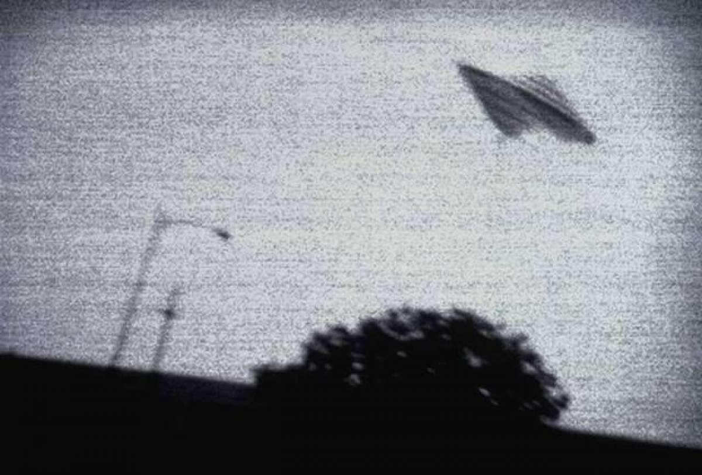

# javascript-challenge

Something innate in us wants there to be life outside of Earth.  My 5 and 7 year olds believe

in aliens like they believe in ghosts, fairies and santa clause.  We mention one idea or story

related to them and their imaginations take off.  Some believe well into adulthood and when

they see something they can't explain they attribute it to aliens and report their sightings.

With this project lets take a small sampling of the reported sightings and review them.  

There is a window for you to enter in a date.  Please use the format of x/x/xxxx, no preceding

zero is necessary for the month or date.  If you do this the search will not return anything.

After you have finished reviewing this information take a look at some of the newly released

U.S. govt files related to UFOs.  You can find them [here][us govt website].

[us govt website]:https://www.theblackvault.com/documentarchive/ufos-the-central-intelligence-agency-cia-collection/

 